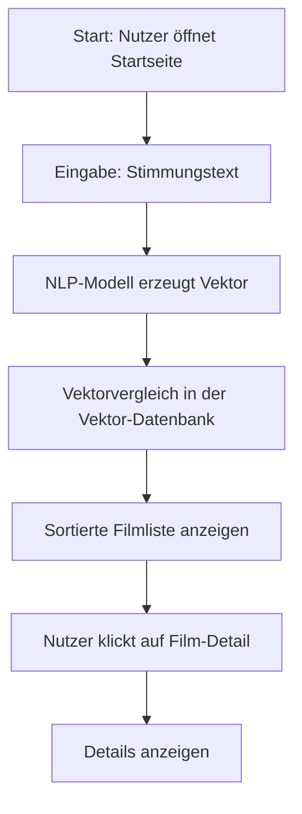
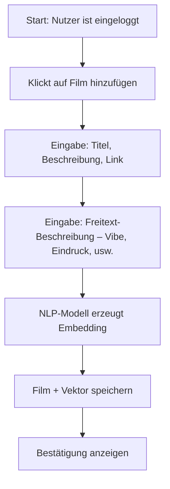
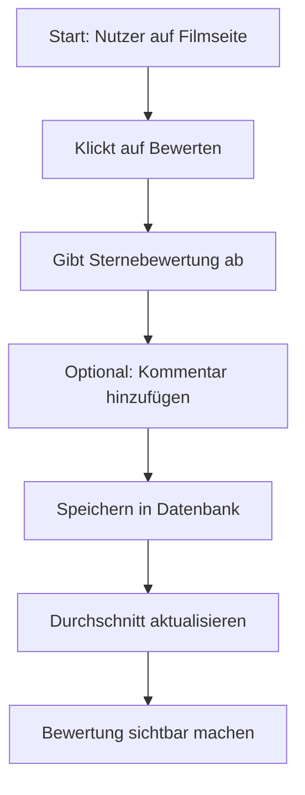
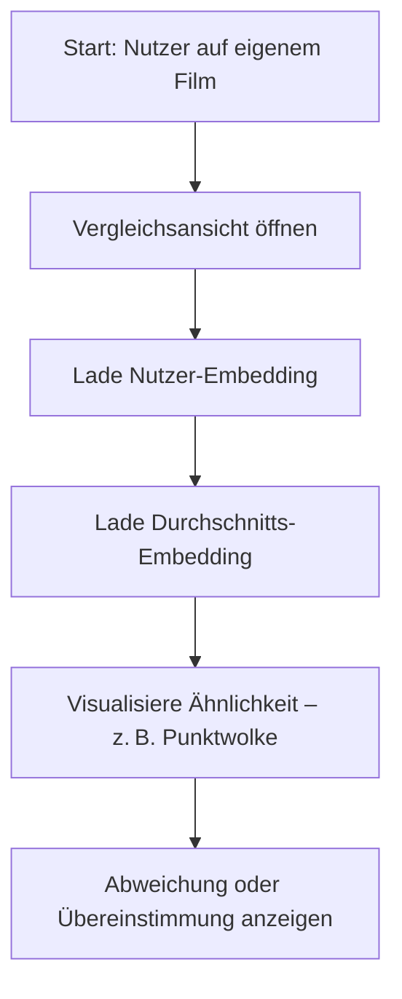
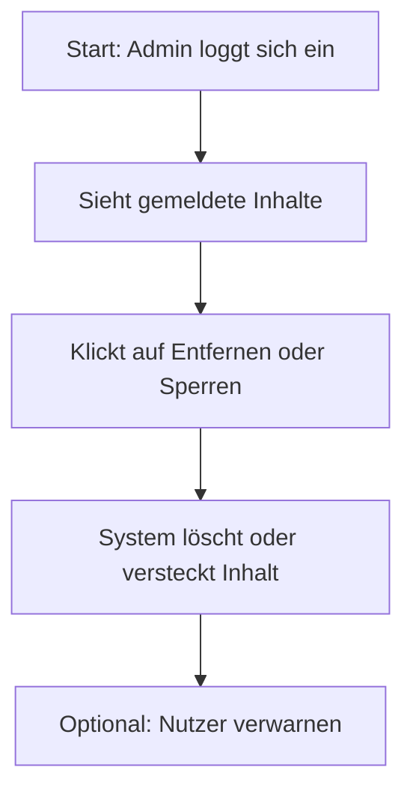
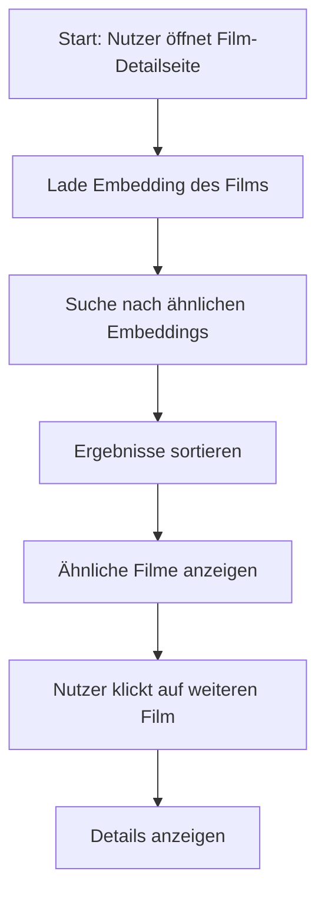

---

# MoVi – Flowcharts der Use Cases (Mermaid-Diagramme)

---

## UC01: Film anhand einer Stimmung finden

---

## UC02: Film beschreiben (taggen)

---

## UC03: Film bewerten und kommentieren

---

## UC04: Eigene Beschreibung mit anderen vergleichen

---

## UC05: Admin löscht problematische Inhalte

---

## UC06: Ähnliche Filme zu einem bestimmten Film anzeigen

