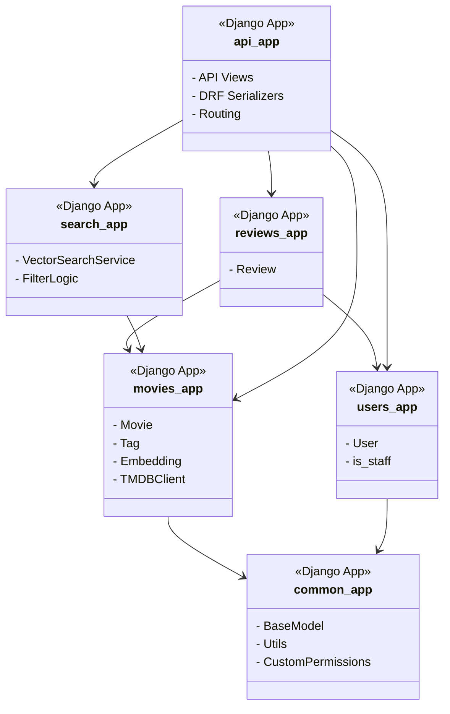

```mermaid
classDiagram
    class movies_app {
        <<Django App>>
        - Movie
        - Tag
        - Embedding
        - TMDBClient
    }

    class reviews_app {
        <<Django App>>
        - Review
    }

    class users_app {
        <<Django App>>
        - User
        - is_staff
    }

    class search_app {
        <<Django App>>
        - VectorSearchService
        - FilterLogic
    }

    class api_app {
        <<Django App>>
        - API Views
        - DRF Serializers
        - Routing
    }

    class common_app {
        <<Django App>>
        - BaseModel
        - Utils
        - CustomPermissions
    }

    %% Relationships
    reviews_app --> movies_app
    reviews_app --> users_app
    movies_app --> common_app
    users_app --> common_app
    search_app --> movies_app
    api_app --> movies_app
    api_app --> reviews_app
    api_app --> users_app
    api_app --> search_app

```

