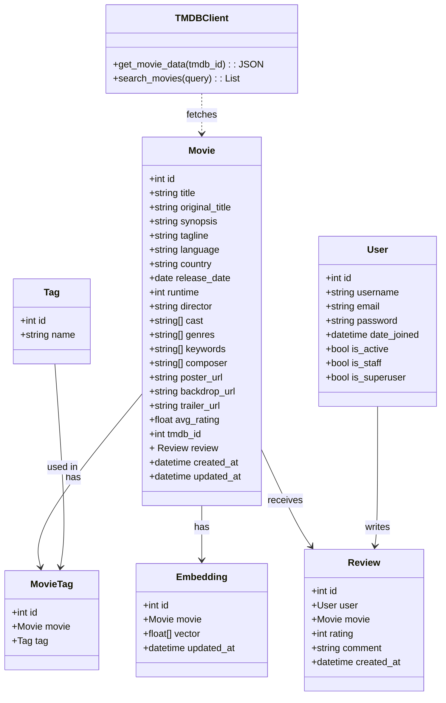

```mermaid
classDiagram
    %% Core domain
    class Movie {
        +int id
        +string title
        +string original_title
        +string synopsis
        +string tagline
        +string language
        +string country
        +date release_date
        +int runtime
        +string director
        +string[] cast
        +string[] genres
        +string[] keywords
        +string[] composer
        +string poster_url
        +string backdrop_url
        +string trailer_url
        +float avg_rating
        +int tmdb_id
        + Review review
        +datetime created_at
        +datetime updated_at
    }

    class Tag {
        +int id
        +string name
    }

    class MovieTag {
        +int id
        +Movie movie
        +Tag tag
    }

    class Embedding {
        +int id
        +Movie movie
        +float[] vector
        +datetime updated_at
    }

    %% Reviews
    class Review {
        +int id
        +User user
        +Movie movie
        +int rating
        +string comment
        +datetime created_at
    }

    %% Auth / User
    class User {
        +int id
        +string username
        +string email
        +string password
        +datetime date_joined
        +bool is_active
        +bool is_staff
        +bool is_superuser
    }

    %% External integration
    class TMDBClient {
        +get_movie_data(tmdb_id): JSON
        +search_movies(query): List<Movie>
    }

    %% Relationships
    Movie --> MovieTag : has
    Tag --> MovieTag : used in
    Movie --> Embedding : has
    Movie --> Review : receives
    User --> Review : writes
    TMDBClient ..> Movie : fetches

```

